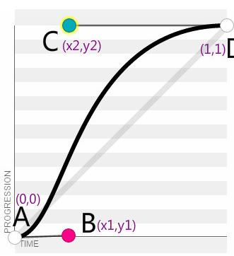

# CSS3 三次贝塞尔曲线(cubic-bezier)
-------------------
animation-timing-function 和 transition-timing-function两个属性来控制动画速度分别提供了ease，liner，ease-in，ease-out，ease-in-out几个预设速度，还可以同过cubic-bezier来自定义速度。 
CSS3动画速度的控制通过三次贝塞尔曲线函数实现，定义规则为 `cubic-bezier (x1,y1,x2,y2)`

### 原理：

看一下什么是三次贝塞尔曲线：

贝塞尔曲线通过控制曲线上的四个点来创造、编辑图形，绘制出一条光滑曲线并以曲线的状态来反映动画过程中速度的变化。 

分别用A,B,C,D表示这四个点，其中起始点固定值为A(0,0),终止点固定为D(1,1)剩下的中间点B(x1,y1),C(x2,y2)也就是所要动态操控的两个点了,对应cubic-bezier (x1,y1,x2,y2)中的四个参数,通过改变B,C两点的坐标值来动态生成一条贝塞尔曲线表示动画中的速度变化。\

### 规则：
